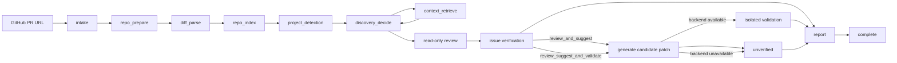

# RepoGuardian

> 默认模式为 `review`：只读审查始终可运行，不生成补丁、不运行项目代码，也不依赖验证执行器。

> `review_and_suggest` 只生成 `unverified` 候选补丁；`review_suggest_and_validate` 才会调用显式选择的验证后端。后端不可用时审查仍会完成并返回 `unsupported` 警告，绝不回退到本地执行。

> 面向 GitHub Pull Request 的 Python 代码审查与受控修复工作台。

RepoGuardian 接收一个 GitHub PR URL，在任务临时 clone 中读取 PR Head、分析 diff 与相关上下文，并生成结构化问题和 Markdown 报告。默认只读审查不运行目标代码；补丁与验证都是显式可选能力，验证结果与候选补丁状态分开返回。

## 适用场景

- 需要在合并前快速审查 Python PR 的正确性、可维护性、性能、安全性与测试覆盖。
- 希望将静态分析、测试、模型审查和补丁验证汇总到一份报告。
- 希望试验自动修复，但不允许系统提交、推送或改写真实仓库。

## 核心能力

| 能力 | 说明 |
| --- | --- |
| PR 准备 | 拉取 PR 元数据，临时 clone 仓库，并生成 Base 与 Head 的统一 diff。 |
| 仓库理解 | 解析变更 hunk，建立 Python 文件和符号索引，检索直接代码、调用方和测试上下文。 |
| 受控审查 | 通过 OpenAI 兼容 Provider 输出并校验 `AgentAction`、`ReviewIssue` 与 `PatchResult`。 |
| 可选验证 | 验证后端只有在 `review_suggest_and_validate` 模式下运行；不可用时返回 `unsupported`，不影响审查完成。 |
| 候选修复 | `review_and_suggest` 生成候选补丁并标记为 `unverified`；只有验证结果为 `passed` 才标记为 `verified`。 |
| 可视化交付 | Vue 控制台展示任务流、Agent 日志、补丁、验证账本；后端提供结构化任务数据与 Markdown 报告。 |

## 工作流



### 可选验证语义

| 阶段 | 工作树 | 目的 |
| --- | --- | --- |
| `base` | PR 合并前版本 | 建立原有测试状态，避免把历史失败归因给 PR。 |
| `head` | PR 当前版本 | 判断 PR 是否引入回归，并作为后续补丁的比较基准。 |
| `patched` | Head + 单个已应用补丁 | 确认该补丁的影响；快照和差异均关联具体 `patch_id`。 |

这些快照和命令仅属于显式 `local` 验证后端；默认 `review` 与 `review_and_suggest` 均不会调用它们。验证基础设施不可用时，候选补丁保持 `unverified`，审查状态不会变为失败。

## 安全与执行边界

- 模型不能提供任意 shell 命令；命令 ID 必须经 Pydantic 校验并由项目适配器解析。
- 补丁先执行 `git apply --check`，再应用到任务临时 clone；**不会 commit、push 或写回用户仓库**。
- 执行环境不会继承宿主机的 API Key、Token、代理等大多数环境变量。
- Agent 决策、上下文检索、诊断与补丁生成均受执行预算限制；超限后收敛为报告。
- LangSmith 追踪默认关闭；即使开启，也默认不上传 prompt、diff、代码上下文或模型输出。

> 仍需注意：当前静态分析与 pytest 在宿主机的临时 clone 中执行，尚未提供容器、网络隔离或资源配额。请仅在可信的运行环境中审查不可信仓库。

## 快速开始

### 1. 创建 Python 环境

```powershell
git clone https://github.com/waangzh/RepoGuardian.git
cd RepoGuardian
conda env create -f environment.yml
conda activate repoguardian
```

如果环境已存在，安装或更新后端依赖：

```powershell
python -m pip install -e .\backend[test]
```

### 2. 配置服务端

```powershell
cd backend
Copy-Item ..\.env.example .env
```

在 `backend/.env` 中至少填写模型服务的 Key：

```env
REPOGUARDIAN_PROVIDER=openai
OPENAI_API_KEY=your-api-key
OPENAI_BASE_URL=https://api.openai.com/v1
REPOGUARDIAN_MODEL=gpt-4.1-mini
```

启动后端：

```powershell
uvicorn app.main:app --reload
```

服务默认运行于 <http://127.0.0.1:8000>；健康检查为 <http://127.0.0.1:8000/health>。

### 3. 启动前端

在另一个终端执行：

```powershell
cd frontend
npm install
npm run dev
```

打开 Vite 输出的地址（通常为 <http://localhost:5173>），输入 PR URL 即可创建审查任务。

## 配置参考

后端从 `backend/.env` 读取配置；可从仓库根目录的 `.env.example` 复制生成。

| 变量 | 默认值 | 说明 |
| --- | --- | --- |
| `GITHUB_TOKEN` | 空 | 可选。用于提高 GitHub API 访问额度或访问受限仓库。 |
| `OPENAI_API_KEY` | 空 | 运行真实模型审查、决策与补丁生成所必需。 |
| `OPENAI_BASE_URL` | `https://api.openai.com/v1` | OpenAI 兼容 API 地址。 |
| `REPOGUARDIAN_PROVIDER` | `openai` | 支持 `openai`、`deepseek`、`openai-compatible`。 |
| `REPOGUARDIAN_MODEL` | `gpt-4.1-mini` | 默认模型名；创建任务时可单次覆盖。 |
| `REPOGUARDIAN_DEFAULT_REVIEW_MODE` | `review` | 默认产品模式；只读审查不会运行目标代码。 |
| `REPOGUARDIAN_DEFAULT_VALIDATION_BACKEND` | `none` | 默认验证后端；只有显式验证模式会使用它。 |
| `REPOGUARDIAN_EXECUTOR` | `reject` | `reject`、`local` 或 `gvisor`；拒绝或 gVisor 占位实现均不会回退到本地执行。 |
| `REPOGUARDIAN_GIT_BIN` | `git` | Git 可执行文件路径或命令名。 |
| `REPOGUARDIAN_WORKDIR` | `backend/.repoguardian/workspaces` | 临时 clone 工作目录。 |
| `REPOGUARDIAN_LANGSMITH_TRACING` | `false` | 是否启用 LangSmith 追踪。 |
| `REPOGUARDIAN_LANGSMITH_INCLUDE_CONTENT` | `false` | 是否上传审查内容；默认关闭。 |

### DeepSeek 示例

```env
REPOGUARDIAN_PROVIDER=deepseek
OPENAI_API_KEY=your-deepseek-key
OPENAI_BASE_URL=https://api.deepseek.com
REPOGUARDIAN_MODEL=deepseek-v4-pro
```

## API

| 方法 | 路径 | 用途 |
| --- | --- | --- |
| `POST` | `/api/reviews` | 创建异步审查任务，返回 `202 Accepted`、任务 ID 与初始状态。 |
| `GET` | `/api/reviews/{task_id}` | 获取任务状态、问题、补丁、验证快照和执行步骤。 |
| `GET` | `/api/reviews/{task_id}/report` | 获取 UTF-8 Markdown 审查报告。 |
| `GET` | `/api/reviews/{task_id}/stream` | 通过 SSE 获取步骤进度和完成事件。 |
| `GET` | `/health` | 服务健康检查。 |

创建任务示例：

```http
POST /api/reviews
Content-Type: application/json

{
  "pr_url": "https://github.com/owner/repo/pull/123",
  "model": "gpt-4.1-mini",
  "mode": "review",
  "generate_patches": false,
  "validation_backend": "none"
}
```

响应：

```json
{
  "task_id": "4b5b1d5d0f8d4e5590f2ad488da37f10",
  "status": "queued"
}
```

`GET /api/reviews/{task_id}` 将审查摘要、问题、候选补丁、验证结论和警告分开返回：

```json
{
  "review": {"mode": "review", "status": "completed", "completed": true},
  "issues": [],
  "patches": [],
  "validation": [{"backend": "none", "status": "not_requested"}],
  "warnings": []
}
```

## 项目结构

```text
RepoGuardian/
├── backend/
│   ├── app/
│   │   ├── api/          # FastAPI 路由与 SSE
│   │   ├── agents/       # Provider 与审查 Agent
│   │   ├── graph/        # LangGraph 状态、节点、路由和修复子图
│   │   ├── models/       # Pydantic 领域模型
│   │   ├── projects/     # 项目识别与受控命令适配器
│   │   ├── services/     # 任务编排、验证与报告
│   │   └── tools/        # GitHub、Git、索引、搜索、patch 与命令执行
│   └── tests/
├── frontend/
│   └── src/
│       ├── api/          # API 客户端
│       ├── components/   # Vue 展示组件
│       └── types/        # 与后端响应同步的类型定义
├── docs/                 # 架构基线、设计目标与 ADR
├── environment.yml
└── .env.example
```

## 验证与开发

后端测试：

```powershell
conda activate repoguardian
cd backend
pytest
```

前端构建检查：

```powershell
cd frontend
npm run build
```

提交前的最小验证：

```powershell
conda activate repoguardian
cd backend
pytest
cd ..\frontend
npm run build
```

变更约定：

- 后端 Pydantic 响应字段变更时，同步更新 `frontend/src/types/review.ts`。
- 图节点、命令执行或补丁流程变更时，补充 `backend/tests/` 回归用例。
- 提交信息使用中文 Conventional Commits，例如 `fix(validation): 修复补丁验证状态错配`。

## 当前限制

- 目前仅提供 Python 项目适配器，验证命令仅覆盖 Ruff 与 pytest。
- 任务状态保存在进程内存，服务重启或多进程部署后不会恢复。
- 不会向 GitHub 写回评论、Check Run、建议或 Draft PR。
- 不会自动提交或推送修复；所有变更仅留在任务临时目录中。
- 不提供 Docker 沙箱、网络隔离或资源配额。

## 许可证

当前仓库尚未声明许可证。若计划开源分发，请先补充 `LICENSE` 文件。
