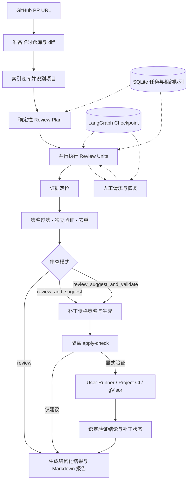

# RepoGuardian

> 面向 GitHub Pull Request 的 AI 代码审查与受控修复工作台。

RepoGuardian 接收一个 GitHub PR URL，在隔离的任务临时目录中准备代码、理解 diff、拆分审查单元，并通过 LangGraph 编排模型审查、证据定位、问题确认、候选补丁和可选验证。最终结果同时以结构化 API、实时事件、Vue 控制台和 Markdown 报告交付。

项目默认采用只读审查模式：**不运行目标仓库代码，不生成补丁，也不会提交、推送或写回真实仓库**。

> [!IMPORTANT]
> RepoGuardian 当前处于早期开发阶段，主要支持 Python 项目，尚未声明开源许可证，也未提供可执行的容器沙箱。请先阅读[安全与信任边界](#安全与信任边界)和[当前限制](#当前限制)。

## 目录

- [为什么使用 RepoGuardian](#为什么使用-repoguardian)
- [核心能力](#核心能力)
- [工作模式](#工作模式)
- [快速开始](#快速开始)
- [工作流与架构](#工作流与架构)
- [验证后端](#验证后端)
- [API 概览](#api-概览)
- [配置](#配置)
- [安全与信任边界](#安全与信任边界)
- [项目结构](#项目结构)
- [开发与验证](#开发与验证)
- [当前限制](#当前限制)

## 为什么使用 RepoGuardian

- **先规划再审查**：确定性分析变更文件，按符号、依赖关系和规模拆分 Review Unit，支持 Preview 和单 Unit 重试。
- **结论必须有证据**：模型给出的行号不被直接信任；服务端重新解析 Base/Head diff，通过代码片段和 anchor 定位可发布位置。
- **Agent 能力受策略约束**：模型输出经过 JSON 解析和 Pydantic 校验，工具范围、调用预算、问题确认和补丁资格均由服务端控制。
- **修复与验证解耦**：候选补丁先经过路径、规模和 `git apply --check` 等确定性检查；只有显式验证模式才调用外部验证后端。
- **任务可追踪、可恢复**：任务、Review Unit、Issue、Patch、验证结果和队列状态写入 SQLite；LangGraph checkpoint 支持人工中断后继续执行。

## 核心能力

| 能力 | 当前实现 |
| --- | --- |
| PR 准备 | 读取 GitHub PR 元数据，在任务工作目录 clone 仓库并生成 Base/Head unified diff。 |
| 审查 Preview | 不调用模型、不运行目标代码，预览纳入文件、Review Unit、风险标签和预估模型消耗。 |
| 仓库理解 | 基于 Tree-sitter 建立 Python 文件与符号索引，检索变更代码、调用方和测试上下文。 |
| 并行审查 | 确定性拆分 Review Unit，受控并发执行；失败 Unit 可独立重试。 |
| Issue 质量控制 | 依次完成证据解析、确定性策略过滤、独立 verifier 和去重，仅发布已确认或需人工判断的问题。 |
| 候选补丁 | 仅为满足 `PatchEligibilityPolicy` 的 confirmed Issue 生成受限 unified diff，并在干净 Head 上独立检查。 |
| 可选验证 | 支持 User Runner 与 Project CI；结果与 `head_sha`、`patch_sha`、profile 和验证来源绑定。 |
| 持久化执行 | SQLite 任务存储、数据库租约队列、重试与 dead-letter、LangGraph checkpoint、外置大文本 artifact。 |
| 可视化交付 | Vue 控制台展示 Preview、任务阶段、Agent 事件、Issue、补丁、验证结果和 Markdown 报告。 |

## 工作模式

三种模式具有明确的产品边界：

| 模式 | 候选补丁 | 目标代码执行 | 验证后端 |
| --- | --- | --- | --- |
| `review` | 不允许 | 不执行 | 强制为 `none` |
| `review_and_suggest` | 需显式设置 `generate_patches=true` | 不执行；仅做 Git 可应用性检查 | 强制为 `none` |
| `review_suggest_and_validate` | 需显式设置 `generate_patches=true` | 仅由显式选择的验证后端决定 | `none`、`user_runner`、`project_ci` 或 `gvisor` |

`review_and_suggest` 生成的补丁始终是 `unverified`。`git apply --check` 只表示补丁可以应用，不代表功能正确。验证后端不可用时，审查仍会完成并记录 `unsupported`、`infrastructure_error` 或 `inconclusive`，不会静默回退到本地执行。

## 快速开始

### 环境要求

- Git
- Conda
- Python 3.11+（`environment.yml` 固定为 Python 3.12）
- Node.js 18+ 与 npm
- 一个 OpenAI 或 OpenAI 兼容服务的 API Key

以下命令以 PowerShell 为例。

### 1. 安装后端

```powershell
git clone https://github.com/waangzh/RepoGuardian.git
cd RepoGuardian
conda env create -f environment.yml
conda activate repoguardian
Copy-Item .env.example backend\.env
```

如果 Conda 环境已经存在，可单独安装或更新后端依赖：

```powershell
python -m pip install -e .\backend[test]
```

编辑 `backend/.env`，至少配置模型服务：

```env
REPOGUARDIAN_PROVIDER=openai
OPENAI_API_KEY=your-api-key
OPENAI_BASE_URL=https://api.openai.com/v1
REPOGUARDIAN_MODEL=gpt-4.1-mini
```

初始化数据库并启动 API：

```powershell
cd backend
alembic upgrade head
uvicorn app.main:app --reload
```

后端默认地址为 <http://127.0.0.1:8000>：

- 健康检查：<http://127.0.0.1:8000/health>
- Swagger UI：<http://127.0.0.1:8000/docs>
- OpenAPI JSON：<http://127.0.0.1:8000/openapi.json>

> [!NOTE]
> 数据库表只通过 Alembic migration 创建。未执行 `alembic upgrade head` 时，服务会明确拒绝启动，而不会自动建表。

### 2. 启动前端

在另一个终端执行：

```powershell
cd frontend
npm install
npm run dev
```

打开 Vite 输出的地址（通常是 <http://localhost:5173>），输入 GitHub PR URL。建议先点击 **Preview** 检查审查范围和预计消耗，再创建任务。

### 3. 创建第一个只读审查

也可以直接调用 API：

```powershell
$body = @{
  pr_url = "https://github.com/owner/repo/pull/123"
  mode = "review"
  generate_patches = $false
  validation_backend = "none"
} | ConvertTo-Json

Invoke-RestMethod `
  -Method Post `
  -Uri http://127.0.0.1:8000/api/reviews `
  -ContentType "application/json" `
  -Body $body
```

服务返回 `202 Accepted` 和任务 ID；可通过任务查询接口或 SSE 事件流跟踪进度。

## 工作流与架构

当前服务实际运行 Review Unit 主图。准备阶段是确定性的，模型审查只在限定的 Unit 和工具范围内执行；Issue 经过服务端证据与策略流水线后，才可能进入修复子图。


```mermaid
flowchart TD
    A["GitHub PR URL"] --> B["准备临时仓库与 diff"]
    B --> C["索引仓库并识别项目"]
    C --> D["确定性 Review Plan"]
    D --> E["并行执行 Review Units"]
    E --> F["证据定位"]
    F --> G["策略过滤 · 独立验证 · 去重"]
    G --> H{"审查模式"}
    H -->|review| M["生成结构化结果与 Markdown 报告"]
    H -->|review_and_suggest| I["补丁资格策略与生成"]
    H -->|review_suggest_and_validate| I
    I --> J["隔离 apply-check"]
    J -->|仅建议| M
    J -->|显式验证| K["User Runner / Project CI / gVisor"]
    K --> L["绑定验证结论与补丁状态"]
    L --> M

    Q[("SQLite 任务与租约队列")] -.-> D
    Q -.-> E
    P[("LangGraph Checkpoint")] -.-> E
    P -.-> N["人工请求与恢复"]
    E -.-> N
    N -.-> E
```

主要分层：

- **FastAPI API 层**：创建、预览、查询、取消、重试、明细、SSE、人工回答和验证协议端点。
- **服务层**：任务编排、持久化、Review Unit 执行、Issue 策略、补丁准入、验证和报告生成。
- **LangGraph 层**：Review Unit 主图、人工中断、证据确认流水线和受控修复子图。
- **工具层**：GitHub、Git、diff、仓库索引、代码搜索、PatchTool 和固定命令执行器。
- **存储层**：SQLAlchemy + SQLite 保存业务状态，LangGraph SQLite saver 保存节点级恢复状态，大文本可外置到本地 artifact 目录。

## 验证后端

验证只在 `review_suggest_and_validate` 模式中运行，且只处理通过 apply-check 的候选补丁。

| 后端 | 状态 | 信任边界 |
| --- | --- | --- |
| `none` | 默认 | 不执行验证；显式验证模式下返回不支持结论。 |
| `user_runner` | 已实现 | 在用户控制的环境执行已注册 profile；使用 Bearer 身份认证、claim lease、HMAC 结果签名和幂等提交。 |
| `project_ci` | 已实现，需配置 | 调用目标仓库显式安装的 GitHub Actions workflow；不创建临时分支，不要求 Contents write。 |
| `gvisor` | 占位 | 当前不可执行，也不会回退到宿主机本地执行。 |

协议与部署细节：

- [User Runner 验证协议](docs/user-runner-protocol.md)
- [Project CI 验证协议](docs/project-ci-validation.md)

无论使用哪种后端，只有仓库、Head SHA、Patch SHA、profile 和信任来源全部匹配的结果，才可能把补丁标记为 `verified`。验证超时或基础设施失败不会把整个审查任务改成失败。

## API 概览

### 审查任务

| 方法 | 路径 | 用途 |
| --- | --- | --- |
| `POST` | `/api/reviews/preview` | 确定性预览审查范围，不创建任务、不调用模型。 |
| `POST` | `/api/reviews` | 创建异步审查任务，返回 `202 Accepted`。 |
| `GET` | `/api/reviews` | 按状态分页查询持久化任务。 |
| `GET` | `/api/reviews/{task_id}` | 获取任务聚合结果。 |
| `POST` | `/api/reviews/{task_id}/cancel` | 取消队列、图执行及关联验证请求。 |
| `POST` | `/api/reviews/{task_id}/units/{unit_id}/retry` | 只重试指定 Review Unit。 |
| `GET` | `/api/reviews/{task_id}/report` | 获取 UTF-8 Markdown 报告。 |
| `GET` | `/api/reviews/{task_id}/stream` | 通过 SSE 接收步骤、补丁和完成事件。 |

服务还提供 Review Unit、Issue、Patch、Validation 和 Human Request 的明细接口，以及 User Runner、Project CI 的协议接口。完整 schema 以运行中的 [Swagger UI](http://127.0.0.1:8000/docs) 为准。

创建任务请求的核心字段：

```json
{
  "pr_url": "https://github.com/owner/repo/pull/123",
  "model": null,
  "mode": "review",
  "generate_patches": false,
  "validation_backend": "none",
  "validation_profile": "unit"
}
```

请求体禁止未知字段。服务端会根据 `mode` 重新约束 `generate_patches` 与 `validation_backend`，不会直接信任客户端组合。

## 配置

后端使用 Pydantic Settings 从启动目录的 `.env` 读取配置。推荐始终在 `backend/` 目录启动 Alembic、Uvicorn 和 pytest；默认数据库、checkpoint、artifact 与临时仓库也位于 `backend/.repoguardian/`。

常用变量如下，完整清单及默认值见 [`.env.example`](.env.example)。

| 变量 | 默认值 | 说明 |
| --- | --- | --- |
| `GITHUB_TOKEN` | 空 | 提高 GitHub API 限额、访问授权仓库；Project CI 必需。 |
| `OPENAI_API_KEY` | 空 | 模型审查、Issue verifier 和候选补丁生成所需。 |
| `OPENAI_BASE_URL` | `https://api.openai.com/v1` | OpenAI 兼容 API 地址。 |
| `REPOGUARDIAN_PROVIDER` | `openai` | `openai`、`deepseek` 或 `openai-compatible`。 |
| `REPOGUARDIAN_MODEL` | `gpt-4.1-mini` | 默认模型；创建任务时可单次覆盖。 |
| `REPOGUARDIAN_DEFAULT_REVIEW_MODE` | `review` | 默认产品模式。 |
| `REPOGUARDIAN_DEFAULT_VALIDATION_BACKEND` | `none` | 默认验证后端。 |
| `REPOGUARDIAN_PROJECT_CI_WORKFLOW` | 空 | 目标仓库中的 Project CI workflow；留空即禁用。 |
| `REPOGUARDIAN_RUNNER_PROFILES` | `unit=project_unit_tests,lint=project_lint` | User Runner 允许的 profile 到逻辑命令 ID 映射。 |
| `REPOGUARDIAN_HUMAN_ANSWER_TOKEN` | 空 | 回答人工请求 API 的 Bearer token。 |
| `REPOGUARDIAN_EXECUTOR` | `reject` | 内建命令执行器；`gvisor` 仍为不可执行占位。 |
| `REPOGUARDIAN_ALLOW_UNSAFE_LOCAL_EXECUTION` | `false` | 是否显式允许宿主机执行；不建议在不可信仓库上启用。 |
| `REPOGUARDIAN_WORKER_MAX_ATTEMPTS` | `3` | 数据库任务队列最大尝试次数。 |
| `REPOGUARDIAN_RETENTION_DAYS` | `30` | 任务与 artifact 保留期限。 |
| `REPOGUARDIAN_LANGSMITH_TRACING` | `false` | 是否启用 LangSmith 追踪。 |
| `REPOGUARDIAN_LANGSMITH_INCLUDE_CONTENT` | `false` | 是否在追踪中包含 prompt、diff、上下文或模型输出。 |

DeepSeek 或其他 OpenAI 兼容服务示例：

```env
REPOGUARDIAN_PROVIDER=deepseek
OPENAI_API_KEY=your-provider-key
OPENAI_BASE_URL=https://api.deepseek.com
REPOGUARDIAN_MODEL=your-model-name
```

新增配置项时请同步更新 `.env.example`。

## 安全与信任边界

- **默认不执行代码**：`review` 和 `review_and_suggest` 不运行 pytest、Ruff、项目入口或其他目标代码。
- **没有任意 shell 入口**：模型只能选择 schema 允许的 action 和逻辑命令 ID；服务端适配器解析为固定 argv，并使用 `shell=false` 执行。
- **补丁不触碰真实仓库**：所有检查只发生在任务临时 clone；系统不会 commit、push、创建 Draft PR 或写回 GitHub review comment。
- **候选补丁相互隔离**：每个补丁从干净 PR Head 开始，受 `allowed_files`、禁止路径、文件数和变更行数限制，结束后恢复工作树。
- **外部验证不接收服务端秘密**：User Runner 不会收到 LLM Key 或 RepoGuardian GitHub Token；Project CI 执行不可信代码的 job 不授予仓库权限或长期秘密。
- **结果需要完整绑定**：验证状态必须与 task、patch、Head SHA、Patch SHA、profile 和可信来源一致；无法验证的结果不会标记为通过。
- **追踪默认最小化**：LangSmith 默认关闭；启用追踪后仍默认排除 prompt、diff、代码上下文和模型输出。
- **持久化不等于生产隔离**：SQLite、checkpoint 和本地 artifact 提供恢复与审计能力，不提供容器、网络隔离、资源配额或多租户安全边界。

> [!WARNING]
> 仓库代码可能是不可信的。除非你理解执行位置和凭据边界，否则不要启用宿主机本地执行。优先使用经过审查的 Project CI workflow 或用户自主管理的 Runner，并为它们配置最小权限、固定 profile 和短期凭据。

## 项目结构

```text
RepoGuardian/
├── backend/
│   ├── alembic/          # 数据库 migration
│   ├── app/
│   │   ├── api/          # FastAPI 路由、SSE 与验证协议
│   │   ├── agents/       # LLM Provider 与审查 Agent
│   │   ├── core/         # 配置和数据库基础设施
│   │   ├── evidence/     # 双侧 diff 索引与证据定位
│   │   ├── graph/        # LangGraph 主图、修复子图、节点与 checkpoint
│   │   ├── models/       # Pydantic 模型与 SQLAlchemy ORM
│   │   ├── projects/     # 项目识别和固定命令适配器
│   │   ├── services/     # 任务、持久化、审查、验证和报告编排
│   │   ├── tools/        # GitHub、Git、diff、索引、搜索和 patch 工具
│   │   └── validation/   # 验证后端注册、选择与实现
│   └── tests/            # 后端单元与集成测试
├── frontend/
│   └── src/
│       ├── api/          # API 与 SSE 客户端
│       ├── components/   # 任务、Issue、Patch、验证和报告组件
│       └── types/        # 与后端响应同步的 TypeScript 类型
├── docs/                 # 验证协议与设计文档
├── .env.example
└── environment.yml
```

## 开发与验证

后端完整测试：

```powershell
conda activate repoguardian
cd backend
pytest
```

后端单文件测试：

```powershell
cd backend
pytest tests/test_provider.py -v
```

前端构建检查：

```powershell
cd frontend
npm run build
```

提交约定：

- 修改图节点时，至少确保 `test_review_pipeline.py` 与 `test_agent_graph.py` 通过。
- 修改命令执行、静态分析、Patch 或验证逻辑时，同步检查白名单、安全边界和对应测试。
- 修改后端 Pydantic 响应字段时，同步更新 `frontend/src/types/review.ts`。
- 提交信息使用一行中文 Conventional Commits，例如 `fix(validation): 修复补丁验证状态错配`。

## 当前限制

- 只接收 GitHub Pull Request URL；尚未适配 GitLab、Bitbucket 或本地 diff。
- 当前只提供 Python 项目适配器；内建固定命令主要覆盖 Ruff 与 pytest。
- 不写回 GitHub review comment、Check Run、suggestion 或 Draft PR，也不会自动提交、推送或合并补丁。
- `gvisor` 仍是不可执行占位后端；项目未提供 Docker 沙箱、默认网络隔离或硬资源配额。
- 默认持久化使用本地 SQLite 与文件 artifact，尚未提供面向多租户、高可用部署的远程存储方案。
- Project CI 需要目标仓库主动安装并维护固定 workflow；User Runner 需要用户自行提供受控执行环境和凭据。
- 当前没有公开 benchmark，模型审查结果仍需工程师复核，尤其是安全问题和自动修复建议。

## 许可证

当前仓库尚未包含 `LICENSE` 文件。这意味着代码不应被视为已获得开源使用、修改或再分发授权；计划公开分发前，请先选择并添加合适的许可证。
